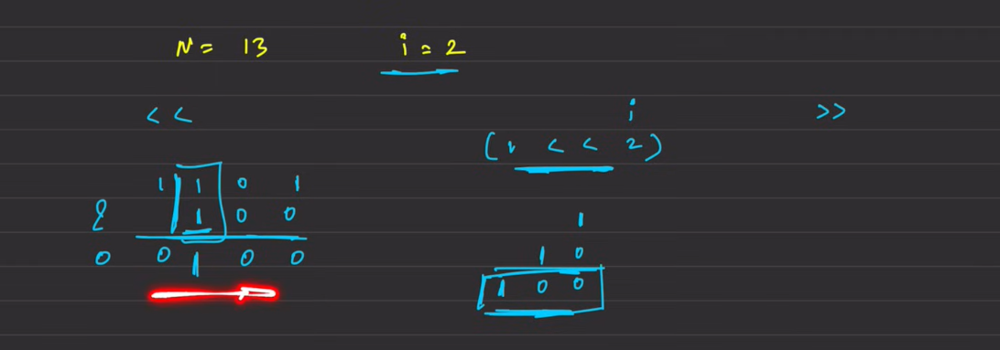

# Given two positive integer n and  k, check if the kth index bit of n is set or not.

```java
class CheckBit {
    static boolean checkKthBit(int n, int k) {
        // code here
        return (n & (1 << k)) != 0;
        // 1 and 1 = 1
    }
}
```


If we shift the 1 k times,and take a and of it , if it is greater than 0 , it means it was set otherwise not


## Set the ith bit

Left thifting the 1 to kth bit and then making a or operation , making that bit set and not changing the other ones

```java
// User function Template for Java
class Solution {
    static int setKthBit(int n, int k) {
        // code here
        return (1<<k) | n;
    }
}
```

## Clear the ith bit
Left shifting the 1 to kth bit and then flipping it and then taking a and of it
``` java
return ~(1<<k-1) & n;
```

## Is power of 2
```cpp
class Solution {
public:
    bool isPowerOfTwo(int n) {
       return n > 0 && (n & (n - 1)) == 0;
    }
};
```

## Counting the number of bits
```cpp
class Solution {
public:
    bool count(int n) {
       int ans = 0;
       while(n > 0){
        count += n&1;
        n = n>>1;
       }
       return ans;
    }
};
```

