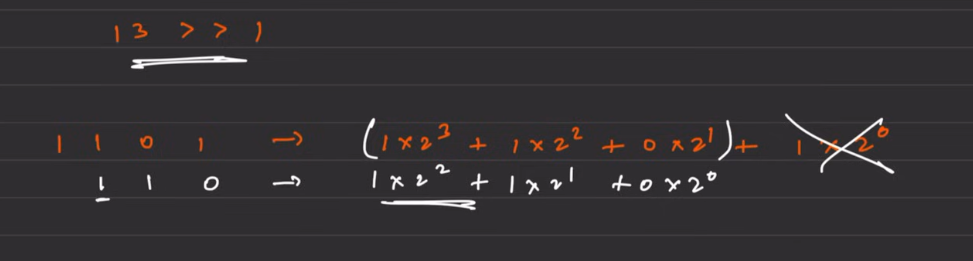
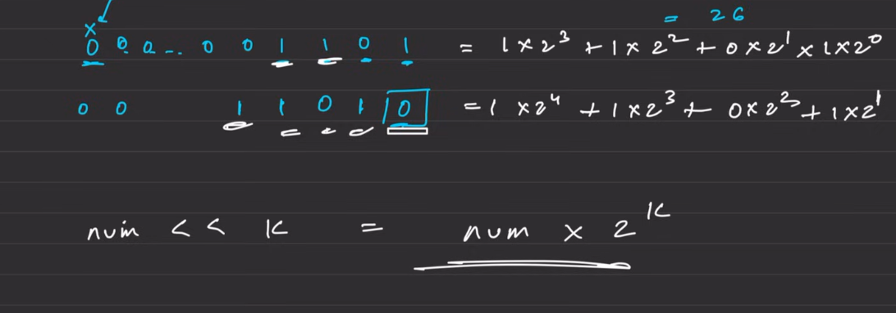

# Bit Manipulation
The way computer stores and use things in memory is in form of 0 and 1 known as bits. These bits combine in unique format to depict different things like a is 65 and is further stored in form of bits.

## Convert binary to decimal
```cpp
class Solution {
  public:
    int binaryToDecimal(string &s) {
        int ans = 0;
        int power = 0;
        for(int i = s.size()-1 ; i >= 0 ;i--){
            int num = s[i] - '0';
            ans += (num * pow(2,power++));
        }
        return ans;
    }
};
```

--- 

## Convert decimal to binary
```cpp
class Solution {
  public:
    string decToBinary(int n) {
        string ans = "";
        while(n!=0){
            int rem = n%2;
            ans += rem + '0';
            n = n/2;
        }
        reverse(ans.begin(),ans.end());
        return ans;
        
    }
};
```

### 1's complement -> Changing every bit is known as 1's complement
### 2's complement -> Finding the 1's complement and then adding 1 to it 


## Different operators
1. **AND** -> all are 1 so 1 otherwise 0
2. **OR** -> atleast 1 so 1 otherwise 0
3. **XOR** -> same bits gives 1 otherwise 0


## Right shift operator (>>)
It means shift all the bits to right by k positions
```1010 >> 1 → 0101```
It also means dividing the number by 2^k, cause when we shift the 





## Left shift operator (<<)
It means shift all the bits to left by k positions
```00000101 → 00001010```
It also means multiplying the number by 2^k,cause when we shift the


## Not operator(~)
Flip the bits 
If it is negative , convert to 2's complement
