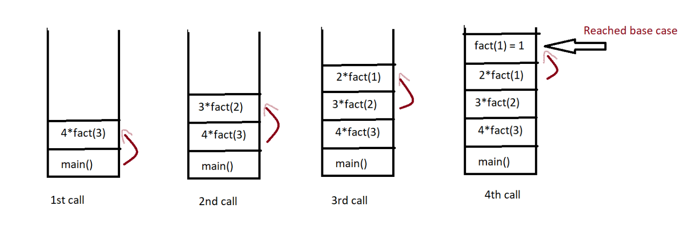

# Recursion

## When a function call itself to perform a repetitive task is known as Recursive functions

There is a base case which specifes when to stop the function otherwise the function will call itself indefinetly and then a common error known as ```stack overflow``` will come when a programme takes more memory that is assigned to it
Watch [What happens during stackoverflow on yt](https://www.youtube.com/watch?v=_6zAAhkU_Iw)

This can be simplified by recursion tree and exaplained through it in detail


### *Figure: This shows the recursive functions call in form of a tree*

---


### `*Figure: This shows the stack calls of a recursive function*

#### In file we have make a recursive function to print 10 times and its recursion tree looks like this:
```scss
print(10)
 ├── print(9)
 │    ├── print(8)
 │    │    ├── print(7)
 │    │    │    ├── print(6)
 │    │    │    │    ├── print(5)
 │    │    │    │    │    ├── print(4)
 │    │    │    │    │    │    ├── print(3)
 │    │    │    │    │    │    │    ├── print(2)
 │    │    │    │    │    │    │    │    ├── print(1)
 │    │    │    │    │    │    │    │    │    └── print(0)
 │    │    │    │    │    │    │    │    └── return
 │    │    │    │    │    │    │    └── return
 │    │    │    │    │    │    └── return
 │    │    │    │    │    └── return
 │    │    │    │    └── return
 │    │    │    └── return
 │    │    └── return
 │    └── return
 └── return

```
 
> ### when one calls finish and returned then only the function gets exited 
> ### Like here the print 0 call will return and then at last the print 10 call will be completed

## Recursive relation