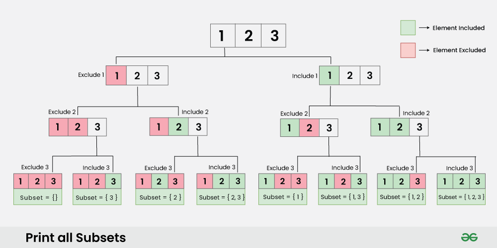

# Subsets - I
This is a general question of backtracking and recursion

## What is a subset
A subset is all the subsequences of the array 

```
Input: arr[] = [1, 2, 3]
Output: [[], [1], [1, 2], [1, 2, 3], [1, 3], [2], [2, 3], [3]]
Explanation: The subsets of [1, 2, 3] are: [[], [1], [1, 2], [1, 2, 3], [1, 3], [2], [2, 3], [3]]
```


## The idea
The main idea behind these type of questions is to take or not take a element ,then making a subset out of it, Go on a index and take that element in a data structure or not take that element in the data structure



This recursion tree provides a clear gist of the idea what we are going to do