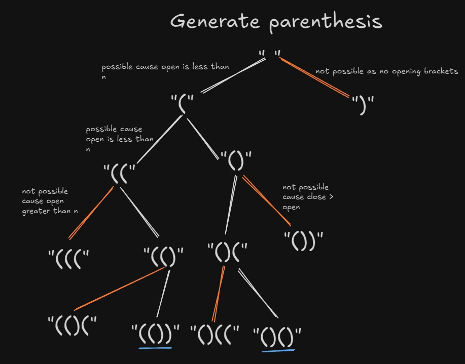

# Generate Parentheses - Recursion

## Problem Statement
Given `n` pairs of parentheses, write a function to generate all combinations of well-formed (valid) parentheses.

**Example:**
- Input: n = 2
- Output: ["(())", "()()"]

- Input: n = 3
- Output: ["((()))", "(()())", "(())()", "()(())", "()()()"]

## Intuition
The key insight is that we need to build valid parentheses combinations by following these rules:
1. We can add an opening parenthesis `(` if we haven't used all `n` opening brackets
2. We can add a closing parenthesis `)` only if the number of closing brackets used is less than the number of opening brackets used (to maintain validity)

This ensures that at any point in our string construction, we never have more closing brackets than opening brackets, which would make the combination invalid.

## Approach

### *Figure: This shows the recursive functions call in form of a tree*

### Decision Tree Approach
At each step, we have two choices:
1. **Add '('** - if we still have opening brackets left (`open < n`)
2. **Add ')'** - if we have more opening brackets than closing brackets (`close < open`)

### Base Case
When both `open == n` and `close == n`, we have used all brackets and formed a valid combination, so we add it to our result.


## Algorithm

```
generate(n, open, close, ds):
    1. If open == n AND close == n:
        - Add ds to answer list
        - Return
    
    2. If open < n:
        - Recursively call generate(n, open+1, close, ds+"(")
    
    3. If close < open:
        - Recursively call generate(n, open, close+1, ds+")")
```

## Code Explanation

```cpp
vector<string> ans;

void generate(int n, int open, int close, string ds){
    // Base case: used all n opening and n closing brackets
    if(open == n && close == n){
        ans.push_back(ds);
        return;
    }

    // Choice 1: Add opening bracket if available
    if(open < n){
        generate(n, open+1, close, ds+"(");
    }

    // Choice 2: Add closing bracket if valid
    if(close < open){
        generate(n, open, close+1, ds+")");
    }
}
```

### Parameters Explained:
- **n**: Total number of pairs of parentheses
- **open**: Number of opening brackets `(` used so far
- **close**: Number of closing brackets `)` used so far
- **ds**: Data structure (current string being built)

## Recursion Tree for n = 2

```
                                    ("", open=0, close=0)
                                           |
                                    (add '(')
                                           |
                                    ("(", open=1, close=0)
                                    /                    \
                            (add '(')                 (add ')')
                                /                          \
                    ("((", open=2, close=0)         ("()", open=1, close=1)
                            |                           /              \
                        (add ')')                 (add '(')        (add ')')
                            |                         /                  \
                    ("(()", open=2, close=1)  ("()(", open=2, close=1)  ✗ (close=2 > open=1)
                            |                         |
                        (add ')')                 (add ')')
                            |                         |
                    ["(())"]              ["()()"]
                  ✓ (open=2, close=2)   ✓ (open=2, close=2)
```

### Detailed Tree Walkthrough:

**Level 0:** Start with empty string
- `generate(2, 0, 0, "")`

**Level 1:** Must add '(' (only valid choice)
- `generate(2, 1, 0, "(")`

**Level 2:** Two choices
- **Left branch:** Add '(' → `generate(2, 2, 0, "((")`
- **Right branch:** Add ')' → `generate(2, 1, 1, "()")`

**Level 3:**
- **From "((":** Can only add ')' → `generate(2, 2, 1, "(()")`
- **From "()":** Two choices:
  - Add '(' → `generate(2, 2, 1, "()(")`
  - Cannot add ')' (would have close=2 > open=1, invalid)

**Level 4:**
- **From "(()":** Add ')' → `generate(2, 2, 2, "(())")` ✓ **VALID - Added to result**
- **From "()(":** Add ')' → `generate(2, 2, 2, "()()")` ✓ **VALID - Added to result**

### Final Result: `["(())", "()()"]`

## Recursion Tree for n = 3 (Expanded)

```
                                        ("", 0, 0)
                                            |
                                        ("(", 1, 0)
                            /                               \
                    ("((", 2, 0)                        ("()", 1, 1)
                    /          \                        /          \
            ("(((", 3, 0)   ("(()", 2, 1)       ("()(", 2, 1)   ("()", 1, 1) → X
                |              /      \             /      \
            ("((())", 3, 1)  |        |         |          |
                |              /        \         /          \
            ("((())", 3, 2)  ("(()(" ) ("(())" ) ("()((") ("()()")
                |           /   3,1      2,2       3,1       2,2
            ["((()))"]   |       ✓        ✓        |         ✓
              ✓         /                           \
                  ("(()(", 3, 2)              ("()(((", 3, 2)
                      |                              |
                  ["(()())"]                    ["()((()))"]
                    ✓                              ✓
                    
    ... (continuing all branches)
```

**Note:** The tree expands significantly with n=3, producing all 5 valid combinations.

## Complexity Analysis

### Time Complexity: **O(4^n / √n)**
- This is the nth Catalan number, which represents the number of valid parentheses combinations
- The exact formula is: Catalan(n) = (2n)! / ((n+1)! × n!)
- Asymptotically, this approaches 4^n / (n^(3/2) × √π)

**Explanation:**
- At each position, we potentially make 2 choices (add '(' or ')')
- Maximum depth of recursion is 2n
- Not all branches are explored due to pruning conditions
- The actual number of valid combinations is the nth Catalan number

### Space Complexity: **O(n)**
- **Recursion stack depth:** O(n) - maximum depth is 2n when we build a complete string
- **String space:** O(n) - each string stores at most 2n characters
- **Output space:** Not counted in space complexity analysis (required for output)

## Key Insights

1. **Greedy Validity:** We maintain validity at every step rather than generating all combinations and filtering
2. **Pruning:** The condition `close < open` prevents invalid paths early
3. **Backtracking Nature:** Though we don't explicitly backtrack, the recursion naturally explores all valid paths
4. **Catalan Numbers:** This problem is a classic application of Catalan numbers in combinatorics

## Common Mistakes to Avoid

1. ❌ **Adding ')' when close >= open** → Creates invalid combinations like ")(" 
2. ❌ **Not checking open < n** → Would add infinite opening brackets
3. ❌ **Using close < n instead of close < open** → Generates invalid combinations
4. ❌ **Forgetting base case** → Infinite recursion

## Variations and Follow-ups

1. **Print only the count** instead of generating all combinations
2. **Check if a given string is valid parentheses** (simpler problem)
3. **Generate with multiple types of brackets:** (), [], {}
4. **Minimum removals to make valid parentheses**

## Trace Example: n = 2

| Call # | open | close | ds    | Action         | Valid? |
|--------|------|-------|-------|----------------|--------|
| 1      | 0    | 0     | ""    | Add '('        | ✓      |
| 2      | 1    | 0     | "("   | Add '('        | ✓      |
| 3      | 2    | 0     | "(("  | Add ')'        | ✓      |
| 4      | 2    | 1     | "(()" | Add ')'        | ✓      |
| 5      | 2    | 2     | "(())"| **BASE CASE**  | ✓ ✅   |
| 6      | 1    | 0     | "("   | Add ')'        | ✓      |
| 7      | 1    | 1     | "()"  | Add '('        | ✓      |
| 8      | 2    | 1     | "()(" | Add ')'        | ✓      |
| 9      | 2    | 2     | "()()"| **BASE CASE**  | ✓ ✅   |

## Practice Problems

1. **LeetCode 22:** Generate Parentheses
2. **LeetCode 20:** Valid Parentheses
3. **LeetCode 32:** Longest Valid Parentheses
4. **LeetCode 301:** Remove Invalid Parentheses

## Related Concepts

- **Backtracking:** Exploring all possible solutions with constraints
- **Catalan Numbers:** Sequence appearing in combinatorial problems
- **Binary Trees:** Catalan numbers also count the number of full binary trees
- **Stack-based Validation:** Alternative approach to validate parentheses

---

**Key Takeaway:** The generate parentheses problem beautifully demonstrates how recursion with proper constraints can efficiently generate all valid combinations without needing to filter invalid ones.
