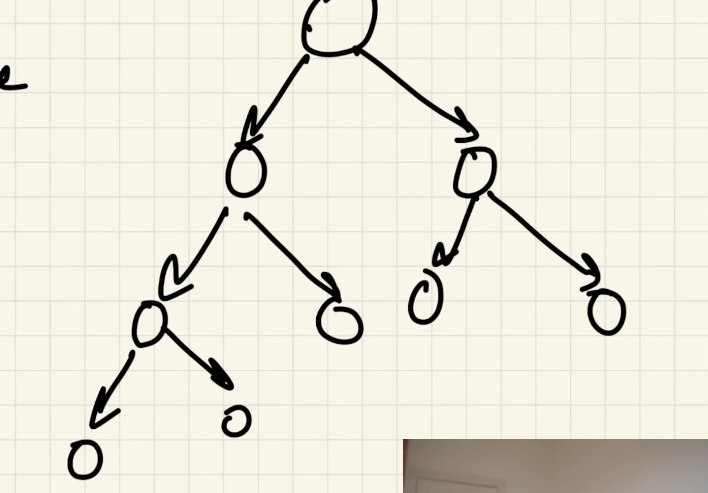
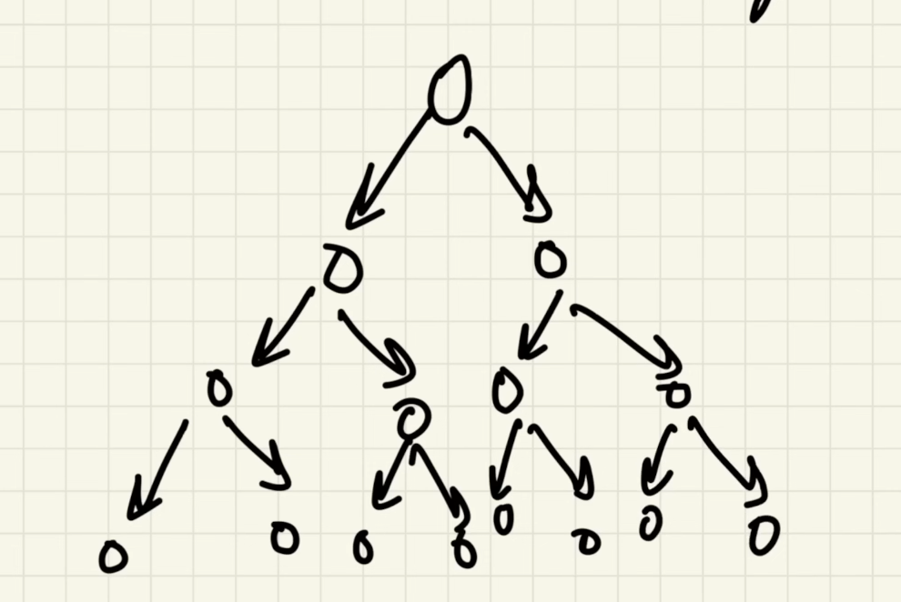

# Trees
The Tree data structure is similar to Linked Lists in that each node contains data and can be linked to other nodes.
The data structure is called a "tree" because it looks like a tree, only upside down, just like in the image below.

> It is a acyclic , connected graph 

## Some Terms
1. Degree of a node → Number of children it has
2. Degree of tree → Maximum degree of any node
3. Depth of a node → Distance from root
4. Height of a node → Longest path to a leaf
5. Height of tree → Height of root
6. Level of node → Depth + 1 (sometimes used interchangeably)
7. Diameter -> The longest path between any two nodes in the tree.

## Type of trees
1. Complete Biney tree => Every level is full except the last level

2. Full/Strict binary Tree => Each node has 0 children or 2 children

3. Perfect binary tree => All the internal has 2 children and leaf nodes are at same level

4. Skewed binary tree => Maximum 1 child of every node